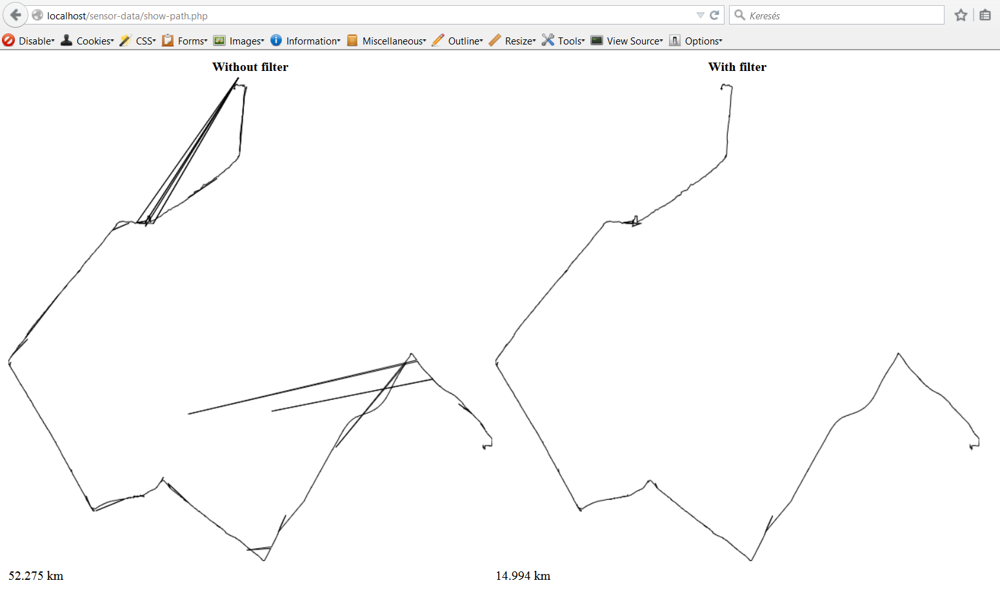

# Normalize sensor data

This app calculates the length of a path stored in KML file, with removing the coordinates that are suspicious to be wrong.
 
## Installation / Usage

```sh
git clone https://github.com/lencse/sensor-data.git

cd sensor-data/

php sensor-data.php data/sensor.kml

```

The repository contains a sample KML file in the data directory. 

## Visualization of the filtered path

You can view `show-path.php` in a browser to show the removed coordinates.
 

